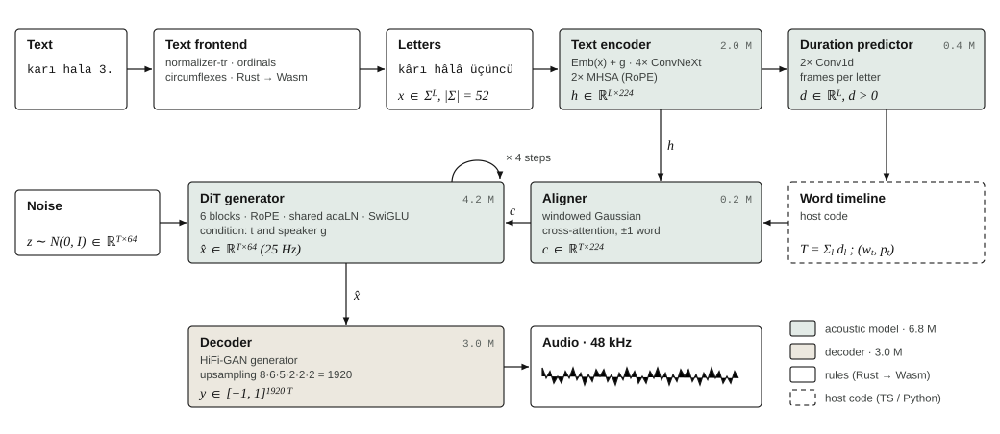
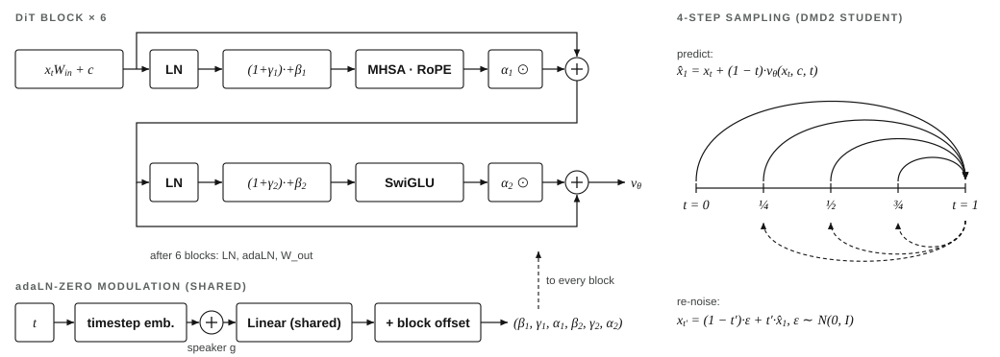

# Okur

**Small, open Turkish text-to-speech that runs anywhere, including in your browser.**

A 6.8 M-parameter acoustic model and a 3 M-parameter decoder, trained from scratch on 298 hours of openly licensed
Turkish speech in about 21 GPU hours on one rented RTX 5090 (≈ $12). It reads Turkish the way people write it: numbers, dates and money
are spelled out, “3.” becomes “üçüncü”, and circumflexes that everyday writing drops are put back
(*alakalı → alâkalı*, *şirketin karı → kârı*, *hala → hâlâ*).

**Try it:** [huggingface.co/spaces/ahakan/okur-tts](https://huggingface.co/spaces/ahakan/okur-tts) runs entirely in your browser.

<p align="center"></p>

- **Runs on** PyTorch (CUDA, CPU, MPS), Apple MLX, ONNX Runtime (CPU, mobile) and in the browser with WebAssembly.
- **One text frontend everywhere:** the Python frontend used in training and a Rust port (compiled to WebAssembly for
  browsers, linkable on mobile) produce identical output, checked on about 4,000 texts.
- **Fully open:** data, training code, evaluation and weights. Training resumes exactly after any interruption.

## Results

Freya-TR-Eval (495 Turkish sentences, one take per system), Whisper-large-v3 word/character error rate, UTMOS22
naturalness, and speed on the same 8 server CPU cores. “Clean” leaves out the 89 sentences that also appear in
Common Voice.

| System | Size | UTMOS ↑ | WER ↓ | WER clean ↓ | CER clean ↓ | CPU speed ↑ | License |
|---|---|---|---|---|---|---|---|
| **Okur v1.0** | 9.8 M | 2.93 | 1.81% | 1.64% | 0.36% | 28× | Apache-2.0 / CC BY 4.0 |
| EMA Lightning | 8.6 M | 3.29 | **1.10%** | **0.96%** | **0.29%** | 21× | Apache-2.0 |
| Piper (dfki voice) | ≈ 16 M | 3.66 | 3.14% | 2.66% | 0.59% | **55×** | CC BY-NC-SA 4.0 |
| Meta MMS-TTS | 36 M | **3.78** | 5.74% | 5.16% | 1.19% | 12× | CC BY-NC 4.0 |

Not measured here: [FreyaTTS-small](https://huggingface.co/freyavoice/Freya-TTS) (183 M, Apache-2.0) reports 8.0% WER
and a human MOS of 3.68 on Freya-TR-Eval under its own protocol (audio downsampled to 8 kHz before Whisper; the same
Piper voice scores 4.4% there and 3.14% here), so those figures are not comparable with this table.

Okur is the least natural of the four and less intelligible than EMA Lightning. It is the only one that restores
circumflexes, reads ordinals and runs in a browser. In Chrome on an Apple M4 it runs about 24× real time
(WebAssembly, 8 threads); with MLX on the M4's GPU, 67×. Reproduce with `scripts/compare_all.sh`.

## Quick start

```sh
git clone https://github.com/ahmethakanbesel/okur-tts && cd okur-tts
uv sync
uv run hf download ahakan/okur-tts --local-dir release          # weights: safetensors + ONNX, ≈ 60 MB
uv run okur say "Bu konuyla alakalı olarak şirketin karı hala artıyor." --model release --out speech.wav
```

`--runtime onnx` (default, CPU), `--runtime torch` (CUDA/MPS/CPU) or `--runtime mlx` (Apple silicon).

From Python:

```python
from pathlib import Path
from okur.export_web import OnnxSynthesizer

tts = OnnxSynthesizer(Path("release/onnx"))
audio = tts.say("Toplantı 3. katta, saat 09:30'da.", speed=1.0, seed=0)  # float32, 48 kHz
```

## How it works

<p align="center"></p>

| Stage | What it does | Size |
|---|---|---|
| Text frontend | [normalizer-tr](https://github.com/erdemtuna/normalizer-tr) by Erdem Tuna (numbers, dates, money, abbreviations), ordinal hints, circumflex restoration, Turkish lowercase, 50-symbol alphabet | rules |
| Text encoder | letter + speaker embeddings, 4 ConvNeXt blocks and 2 attention blocks (d = 224) | 2.0 M |
| Duration predictor | frames (40 ms) per letter; the speed control divides these | 0.4 M |
| Word timeline + aligner | every frame gets its word and position in it; a Gaussian attention window (±1 word) turns letters into per-frame conditioning, so words can't be skipped or repeated | 0.2 M |
| DiT generator | 6 transformer blocks with RoPE and shared adaLN, flow matching; distilled with DMD2 from 16 steps to 4 | 4.2 M |
| Decoder | HiFi-GAN-style, upsamples 64-dim 25 Hz latents 1920× to 48 kHz audio | 3.0 M |

The design follows the public description of [EMA Lightning](https://huggingface.co/canberkkkkkk/ema-lightning). This
is an independent implementation trained from scratch on open data. Training targets are latents of the frozen
[ACE-Step 1.5](https://huggingface.co/ACE-Step/Ace-Step1.5) VAE; letter durations come from forced alignment with a
Turkish wav2vec2 model. See [docs/TRAINING.md](docs/TRAINING.md) to reproduce everything.

Building blocks: flow matching ([Lipman et al., 2023](https://arxiv.org/abs/2210.02747)), Diffusion Transformer ([Peebles & Xie, 2023](https://arxiv.org/abs/2212.09748)), ConvNeXt ([Liu et al., 2022](https://arxiv.org/abs/2201.03545)), RoPE ([Su et al., 2021](https://arxiv.org/abs/2104.09864)), duration-based Gaussian alignment (Non-Attentive Tacotron, [Shen et al., 2020](https://arxiv.org/abs/2010.04301)), DMD2 ([Yin et al., 2024](https://arxiv.org/abs/2405.14867)) and HiFi-GAN ([Kong et al., 2020](https://arxiv.org/abs/2010.05646)).

## Repository

| Path | |
|---|---|
| `src/okur/frontend/` | text frontend (Python) |
| `frontend-rs/` | the same frontend in Rust; WebAssembly build for browsers |
| `src/okur/model/` | acoustic model, decoder, discriminators, timeline |
| `src/okur/train/` | fault-tolerant trainers: acoustic, decoder GAN, DMD2 |
| `src/okur/data/` | corpus readers, forced alignment, codec, Parquet shards |
| `src/okur/runtime_mlx/` | Apple MLX runtime |
| `src/okur/export.py`, `export_web.py` | ONNX exports (server, browser/mobile) |
| `src/okur/evals/` | Freya-TR-Eval harness (Whisper-large-v3 WER/CER) |
| `web/` | the browser demo (TypeScript, ONNX Runtime Web, Cloudflare Pages) |
| `scripts/` | cloud bootstrap, supervised training, system comparison |

Development: `uv run pytest -q` (Rust parity tests need `cargo`), `uv run ruff check`, `uv run pyright`;
web: `cd web && npm ci && npm test && npm run build`.

## Web demo

```sh
cargo build --release --target wasm32-unknown-unknown --manifest-path frontend-rs/Cargo.toml
uv run okur export-web <acoustic> <decoder> cv:ca179eb54e4e --out runs/web_export/fp16
cd web && npm ci
node scripts/assets.mjs ../runs/web_export/fp16 ../frontend-rs/target/wasm32-unknown-unknown/release/okur_frontend.wasm ../demo
npm run build && npm run preview                 # local preview with production headers
npm run deploy                                    # Cloudflare (cf deploy; see cloudflare.config.ts)
```

`../demo` is the output of `scripts/compare_all.sh` (comparison audio, metrics). After changing the example texts in
`web/src/i18n.ts`, regenerate their precomputed readings with `uv run python scripts/web_readings.py`. The page is
Turkish by default with an English version (`?lang=en`) and needs cross-origin isolation for multithreaded
WebAssembly; `web/public/_headers` sets it on Cloudflare. Live demo: https://huggingface.co/spaces/ahakan/okur-tts

## Limitations

- One voice, from about 5 hours of crowd-sourced recordings. It is less natural than models trained on a studio voice.
- Circumflex restoration is rule-based: an ambiguous *kar* without business context stays *kar* (snow).
- Foreign names and most abbreviations are read with Turkish letter sounds.

## Citation

```bibtex
@software{besel2026okur,
  author  = {Be{\c{s}}el, Ahmet Hakan},
  title   = {Okur: a small, open {Turkish} text-to-speech model that runs in the browser},
  year    = {2026},
  version = {1.0.0},
  url     = {https://github.com/ahmethakanbesel/okur-tts},
  note    = {Code: Apache-2.0; weights: CC BY 4.0}
}
```

Please also cite the training corpora listed in [NOTICE](NOTICE) and, for the method, DMD2
(Yin et al., 2024) and flow matching (Lipman et al., 2023).

## License and attribution

Code: Apache-2.0. Weights: CC BY 4.0. Training data: Mozilla Common Voice (CC0), ISSAI Turkish Speech Corpus (MIT),
MediaSpeech and Google FLEURS (CC BY 4.0). See [NOTICE](NOTICE) and [MODEL_CARD.md](MODEL_CARD.md).

The voice belongs to an anonymous Common Voice contributor who released their recordings under CC0. Please don't use
this model to impersonate anyone or to deceive listeners about speech being synthetic.
